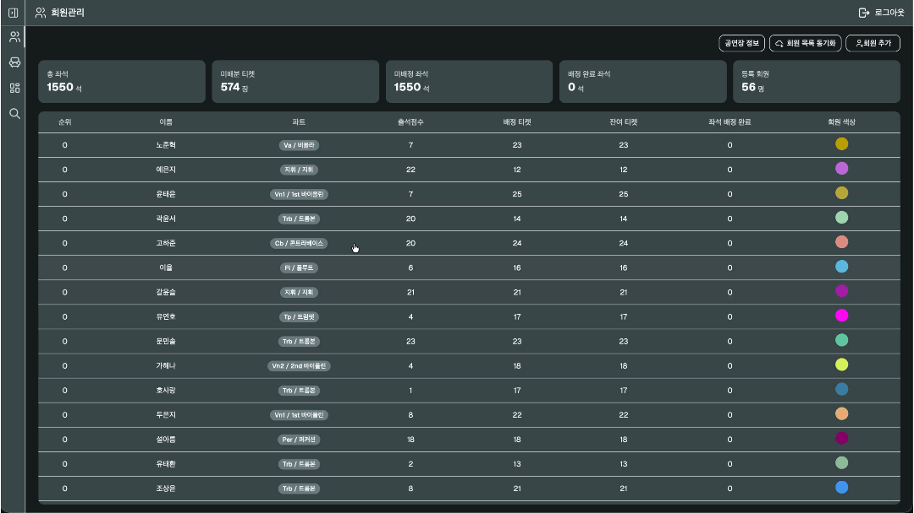
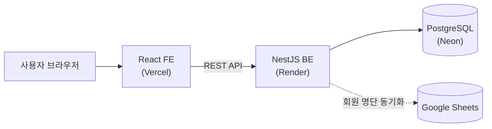
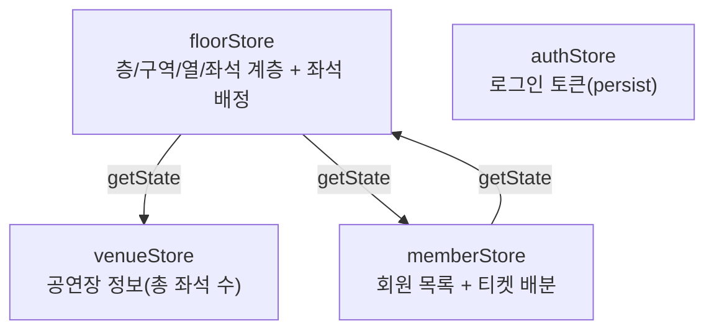

# orchestra-ticket


60~70명 규모의 아마추어 오케스트라 동호회가 연 1회 공연 때마다 엑셀로 수기 관리하던 회원별 티켓 배분과 좌석 배정을, 웹에서 처리할 수 있게 만든 관리 시스템입니다.

## 배포 링크

<!-- 프로덕션 링크(Vercel) 입력 필요: https://... -->
<!-- 공개 좌석 조회 페이지: {프로덕션 도메인}/seats/view -->

- 관리자 페이지(회원 관리 / 좌석 설정 / 좌석 배정): 관리자 권한 있는 회원으로 로그인 필요
- 공개 좌석 조회 페이지(`/seats/view`): 로그인 없이 이름 검색만으로 접근 가능

## 스크린샷 / 데모
<!-- YOUTUBE 링크 -->

### 좌석 설정

층 → 구역 → 열 → 좌석 순서로 공연장 좌석 구조를 등록한다.

### 회원 관리 & 티켓 배분

회원을 등록하고, 전체 좌석 수 기준으로 티켓을 균등 배분하거나 개인별로 직접 조정한다.

### 좌석 배정

좌석 배치도에서 여러 좌석을 선택해 회원을 배정한다. 배정된 좌석은 회원별 색상으로 구분된다.

### 공개 좌석 조회

로그인 없이 이름(초성 포함)으로 검색해 본인 좌석 위치를 확인할 수 있다.

## 문제 정의

회원 60~70명, 좌석 1,464석 규모의 공연을 TF 7~8명이 매년 엑셀로 수기 관리하고 있었습니다.

| 구분       | Before (엑셀 수기 작업)                    | After (이 시스템)                                          |
|----------|--------------------------------------|--------------------------------------------------------|
| 티켓 배분    | TF가 회원 60~70명분 배분 수량을 엑셀에서 하나씩 계산·기록 | 별도의 회원 목록 동기화 (구글 스프레드시트에서 관리되고 있는 데이터를 API로 가져와서 동기화) |
| 좌석 배정    | 1,464석 규모 좌석표를 시트에서 대조하며 하나씩 배정      | 좌석 배치도에서 여러 좌석을 선택해 한 번에 배정, 잔여 티켓 부족한 회원은 선택 자체가 막힘   |
| 배정 현황 확인 | 회원이 본인 자리를 물어보면 TF가 개별 응대            | 회원이 직접 공개 페이지에서 이름으로 검색해 확인                            |
| 오류 검증    | 중복 배정·초과 배정을 수기로 대조해야 발견 가능          | 미배분 티켓 초과 시 저장 자체를 막는 검증 로직 내장                         |

## 핵심 기능

### 좌석 설정

공연장마다 층/구역/열/좌석 구조가 달라 매번 새로 등록해야 합니다. 공연장의 총 좌석 수는 `venueStore`, 층 → 구역 → 열 → 좌석 계층은 `floorStore`로 나눠 관리합니다.

### 회원 관리 & 티켓 배분

다른 서비스로 관리되고있는(회원 정보는 다른 개발자가 관리한 곳에서 동기화, 구글 스프레드 API 사용)  
1차로 회원 목록 동기화 후 별도로 수정 가능합니다(티켓 수 조정 및 회원 정보 수정).

### 좌석 배정

좌석이 1,000석대로 많아 화면만 보고 누가 앉았는지 바로 구분할 수 있어야 합니다. 배정된 좌석은 회원 색상으로 표시하고, 배정 모달에서는 잔여 티켓이 있는 회원만 선택 가능한 상태로 정렬해 잘못 배정할 여지를 줄였습니다.

### 공개 좌석 조회

공연 당일 회원이 자기 자리를 찾으려고 매번 관리자에게 물어보는 게 비효율적이라, 로그인 없이 이름(초성 포함)으로 검색만 하면 좌석을 확인할 수 있는 읽기 전용 페이지를 따로 뒀습니다.

## 기술 스택

| 카테고리 | 기술 | 선택 이유 |
|---|---|---|
| 프레임워크 | React 19 + TypeScript | 컴포넌트 단위 개발과 타입 안정성 확보 |
| 번들러 | Vite | 빠른 개발 서버 구동과 HMR |
| 상태관리 | Zustand | venue/floor/member/auth 도메인별 store 분리로 관심사 분리, Redux 대비 보일러플레이트 적음 |
| 라우팅 | react-router-dom v7 | `createBrowserRouter` + `ProtectedRoute`로 인증 필요 라우트와 `/seats/view` 같은 공개 라우트를 `isPublic` 플래그 하나로 분기 |
| CSS | Tailwind CSS v4 | 유틸리티 우선 스타일링. 다만 회원별 동적 색상처럼 런타임에만 정해지는 값은 클래스 대신 inline style로 별도 처리(트러블슈팅 참고) |
| UI 컴포넌트 | shadcn/ui + radix-ui | 접근성이 갖춰진 헤드리스 컴포넌트를 디자인 토큰에 맞게 커스터마이징 |
| 한글 검색 | es-hangul | 공개 좌석 조회 페이지의 초성 검색 |
| 색상 선택 | react-colorful | 회원별 좌석 배정 색상 지정 UI |
| 확대/축소 | react-zoom-pan-pinch | 좌석 배치도가 넓어 확대·축소·이동 인터랙션 필요 |
| 토스트 알림 | sonner | API 성공/실패 피드백 |
| 아이콘 | @tabler/icons-react, lucide-react | 일관된 스트로크 두께의 아이콘 세트 |

## 아키텍처



백엔드/DB는 별도 레포로 분리되어 있고, 이 레포는 FE만 다룹니다.

상태관리는 도메인별 store로 나뉘어 있고, 일부 store의 액션은 다른 store의 최신 상태를 참조해야 합니다.



Zustand의 `useXStore()` 훅은 컴포넌트 안에서만 호출할 수 있는데, store 액션 함수 자체는 컴포넌트 밖에 정의됩니다. 예를 들어 `floorStore`의 미배분 티켓 수 계산(`getUnallocatedTickedCount`)은 `venueStore`의 총 좌석 수와 `memberStore`의 배정 수량을 함께 봐야 하는데, 이럴 때 훅 대신 `useVenueStore.getState()` / `useMemberStore.getState()`로 다른 store의 스냅샷을 그때그때 꺼내옵니다. 회원 삭제 시 좌석 배정을 정리하는 로직도 같은 방식으로 `memberStore`에서 `useFloorStore.getState().clearMemberSeats(id)`를 호출합니다.

## 트러블슈팅

### 1. Dialog 바깥 클릭 시 닫힘 핸들러 충돌

**문제**: 회원 상세 Dialog에서 바깥 영역을 클릭하면 닫힘 처리가 두 번 겹쳐 실행됐다.

**원인**: Radix Dialog는 `open`/`onOpenChange`만으로 이미 바깥 클릭 시 닫힘을 제어하는데, `DialogContent`의 `onInteractOutside`에도 같은 닫힘 함수를 중복으로 연결해 두었다.

**해결**: `onInteractOutside`를 제거하고 `onOpenChange` 하나로 닫힘 로직을 일원화했다.

```tsx
// Before
<DialogContent className="..." onInteractOutside={onClose}>

// After
<DialogContent className="...">
```

### 2. 좌석 다중 선택 상태를 배열이 아닌 Set으로 관리

**문제**: 좌석 배치도에서 클릭으로 여러 좌석을 동시에 선택해야 하는데, 배열로 관리하면 좌석마다 선택 여부를 확인(`includes`)할 때마다 매번 배열 전체를 훑어야 했다.

**원인**: 한 화면에 좌석이 수백 개까지 렌더링되고, 좌석 하나하나가 렌더링될 때마다 "내가 선택됐는지"를 조회한다.

**해결**: 선택 상태를 `Set<number>`로 바꿔 조회/추가/삭제를 O(1)로 처리했다.

```tsx
const [selectedSeatIds, setSelectedSeatIds] = useState<Set<number>>(new Set());
const next = new Set(selectedSeatIds);
next.has(id) ? next.delete(id) : next.add(id);
setSelectedSeatIds(next);
```

### 3. 회원별 동적 색상 표시에는 Tailwind 클래스를 쓸 수 없었다

**문제**: 배정된 좌석을 회원마다 다른 색으로 표시해야 하는데, 색상 값이 회원마다 다른 hex 문자열(서버에서 내려옴)이었다.

**원인**: Tailwind는 빌드 시점에 소스 코드를 정적으로 스캔해 실제로 쓰인 클래스만 CSS로 만든다. `bg-[${color}]`처럼 런타임에 조합되는 클래스명은 스캔 시점에 문자열로 존재하지 않아 최종 CSS에 포함되지 않는다.

**해결**: className 대신 `style` prop으로 `backgroundColor`를 직접 주입하고, 배경 대비 텍스트 색은 WCAG 상대 휘도 공식으로 자동 계산했다.

```tsx
style={{
  backgroundColor: bgColor,
  color: getContrastTextColor(bgColor),
}}
```

### 4. 모달 내부 상태 초기화: useEffect 대신 key prop

**문제**: 회원 상세 Dialog를 열어놓은 채 다른 회원으로 바로 전환하면 폼 입력값이 이전 회원 것으로 남아있는 경우가 있었다.

**원인**: React는 같은 위치에 같은 컴포넌트 타입이 렌더링되면 인스턴스를 재사용한다. props만 바뀌고 컴포넌트가 언마운트되지 않으면 `useState` 초기값은 다시 평가되지 않는다.

**해결**: 매번 `useEffect`로 상태를 동기화하는 대신, 선택된 대상의 id를 `key`로 넘겨 React가 다른 인스턴스로 인식해 강제로 리마운트하게 했다.

```tsx
<MemberInfoDialog key={selectedMember?.id ?? 'new'} member={selectedMember} onClose={onClose} />
```

## 디렉토리 구조

```
src/
├── components/
│   ├── common/        # 공통 컴포넌트(PageHeader 등)
│   ├── dialog/         # Dialog 컴포넌트
│   ├── member/         # 회원 관련 컴포넌트
│   ├── seat/            # 좌석 배치도 표시(SeatGrid, SeatMinimap)
│   ├── seat-assign/    # 좌석 배정 화면 전용 컴포넌트
│   └── ui/                # shadcn/ui 기반 기본 UI 컴포넌트
├── constant/           # env.ts 등 상수
├── hooks/               # 커스텀 훅
├── lib/                   # api.ts, seatUtils.ts 등 유틸리티
├── mocks/               # 개발/테스트용 목데이터
├── pages/               # 페이지 컴포넌트
├── store/                # Zustand 스토어(venue/floor/member/auth)
├── types/                # 타입 정의
└── router.tsx           # 라우터 설정
```

## 로컬 실행 방법

```bash
npm install
```

루트에 `.env` 파일을 만들고 아래 값을 채웁니다.

```
VITE_API_URL=
```

```bash
npm run dev
```

## 회고

<!-- 노션 회고 페이지가 비어 있어 코드 관찰 기반으로 임시 작성했습니다. 본인 경험대로 수정해주세요 -->

잘한 점은 store 간 참조를 `getState()`로 명시적으로 드러낸 것과, Dialog 충돌·좌석 색상처럼 사소해 보이는 문제도 원인까지 파악해서 고친 것입니다. 아쉬운 점은 테스트 코드가 없어 변경할 때마다 수동으로 확인해야 한다는 점입니다. Tailwind의 클래스 스캔 방식과 한계, 그리고 `key` prop으로 컴포넌트를 강제 리마운트하는 패턴을 실제로 겪으며 배웠습니다.
